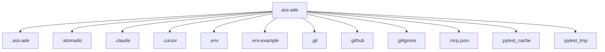

# Architecture

## Repository Overview

- **Total files:** 293
- **Total directories:** 40
- **Primary language:** python
- **Detected languages:** py, md, json, log, txt, jsonl, yml, js, ipynb, example, toml

## Top-Level Structure

## Entry Points

- `ass-ade`

## Test Framework

pytest

## CI Systems

- github-actions
