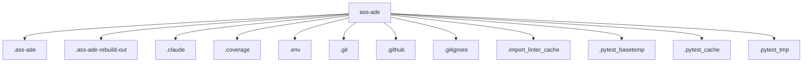

# Architecture

## Repository Overview

- **Total files:** 7109
- **Total directories:** 2393
- **Primary language:** python
- **Detected languages:** json, py, md, yml, toml, txt, jsonl, snapshot, rs, ps1, ts, yaml, swift, mmd, kt, log, patched, kts, ipynb, agent, cmd, in, tag, pyc, ini, bak, lock, mjs, js

## Top-Level Structure

## Entry Points

- `ass-ade`
- `atomadic`

## Test Framework

pytest

## CI Systems

- github-actions
