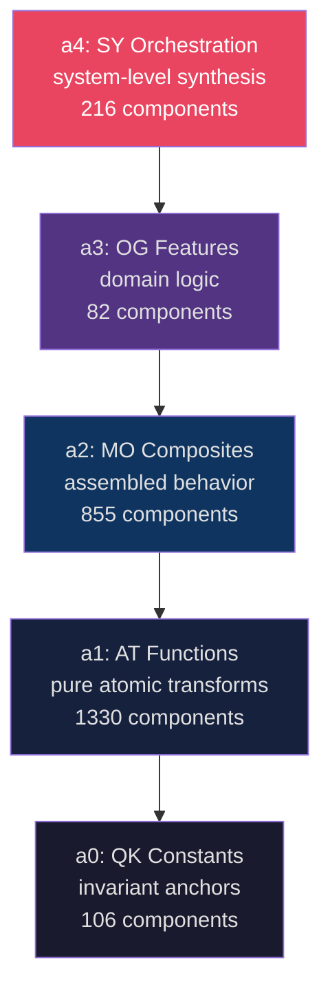
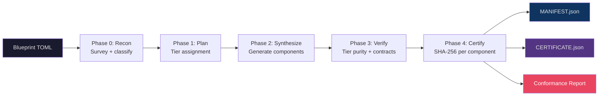

```
  ___   ____  ____      _    ____  _____
 / _ \ / ___||  _ \    / \  |  _ \| ____|
| | | |\___ \| |_) |  / _ \ | | | |  _|
| |_| | ___) |  __/  / ___ \| |_| | |___
 \___/ |____/|_|    /_/   \_\____/|_____|

Autopoietic Software Synthesis — Autonomous Development Engine
```

[](https://github.com/AAAA-Nexus/ASS-ADE)
[](LICENSE)
[](https://python.org)
[](BIRTH_CERTIFICATE.md)
[](CERTIFICATE.json)

---

> **Blueprint is truth. Code is artifact.**
>
> ASS-ADE synthesizes entire codebases from structured blueprints, verifies every component with SHA-256 cryptographic proof, and tracks every rebuild with a signed certificate. On launch day, it rebuilt **2,195 components** with **100% structural conformance** from its own codebase.

---

## 🤔 What Is This, in Plain English?

Imagine your software project as a building. Most teams build it brick by brick (writing code), then try to draw the blueprints afterward (writing docs). By the time the building is done, the blueprints are guesses.

ASS-ADE inverts this. You write the **blueprint first** — a structured description of what each module should be, how it should relate to others, what tier it lives in. ASS-ADE then **synthesizes the building from the blueprint**, verifies every brick, and hands you a signed certificate proving the structure matches the plan.

When requirements change, you update the blueprint and rebuild. The certificate tells you exactly what changed. No archaeology. No drift. No mystery.

---

## ⚡ 60-Second Quick Start

```bash
# Install
pip install ass-ade

# Map your codebase (what does it look like right now?)
ass-ade phase0-recon --path .

# Run synthesis against a blueprint
ass-ade synthesize --blueprint blueprint.toml

# Verify your certificate
ass-ade certify --verify

# In Claude Code or VS Code (MCP)
# Add to your .mcp.json:
# { "mcpServers": { "ass-ade": { "command": "python", "args": ["-m", "ass_ade.mcp_server"] } } }
```

That's it. You now have a MANIFEST, a CERTIFICATE, and a conformance score.

---

## 🔄 What ASS-ADE Does — Before & After

### Before: Traditional Development

```
You write code
  → Code drifts from design
  → Architecture diagram lies
  → Senior devs spend 30% of time on archaeology
  → "Why is this here?" becomes the most common question
```

### After: Blueprint-Driven Synthesis

```
You write the blueprint
  → ASS-ADE synthesizes the code
  → Every component SHA-256 verified against spec
  → MANIFEST + CERTIFICATE on every run
  → Conformance score is a number, not a feeling
```

### The Tangible Difference

| Metric | Before | After |
|--------|--------|-------|
| Architecture conformance | Unknown ("probably fine?") | 100% measured, SHA-256 certified |
| Component provenance | Git blame + guesswork | Blueprint → MANIFEST → CERTIFICATE chain |
| Drift detection | Manual review | Automated conformance delta |
| Onboarding question | "Why is this the way it is?" | "What does the blueprint say?" |
| Rebuild time | Hours to days | 75–90 seconds (maiden run: 75.7s) |

---

## 🏗️ Five-Tier Monadic Architecture

ASS-ADE organizes all synthesized code into five tiers. **Dependencies flow strictly downward** — a tier can only import from tiers below it, never above. This is enforced at synthesis time, not just by convention.



| Tier | Prefix | Role | Current Components |
|------|--------|------|-------------------|
| a0 | `qk_` | Invariant constants, mathematical anchors | 106 |
| a1 | `at_` | Pure atomic functions, composable transforms | 1,330 |
| a2 | `mo_` | Stateful modules, assembled behavior | 855 |
| a3 | `og_` | Domain features, business logic | 82 |
| a4 | `sy_` | Orchestration, system synthesis | 216 |
| **Total** | | | **2,589** *(as of latest rebuild)* |

**Why this matters:** You can synthesize a single tier in isolation. Changing features (a3) doesn't force a rebuild of constants (a0). Shipping a new orchestration pattern (a4) doesn't invalidate your atomic functions (a1). Architecture is enforced structurally, not by style guide.

---

## 🧩 Component Lifecycle: `draft_` → stable → `certified_`

Synthesized components start with a `draft_` prefix — for example:
- `at_draft_rebuild_codebase.py`
- `qk_draft_agent_token_budget.py`

This is intentional. It signals exactly where a component is in its maturity arc:

| State | Filename | Meaning |
|-------|----------|---------|
| `draft_` | `at_draft_my_function.py` | First-generation synthesis — functional, may need refinement |
| stable | `at_my_function.py` | Passed quality gates: test coverage, tier purity, doc coverage |
| `certified_` | `certified_at_my_function.py` | Enterprise-grade, PQC-signed, compliance-ready |

Every component **earns** its status through the pipeline. Nothing is promoted by hand — the quality gate enforces it. This is the trust-gated evolution system in practice.

---

## 🛠️ All Commands

| Command | Description |
|---------|-------------|
| `ass-ade phase0-recon --path .` | Survey codebase, identify decomposition candidates |
| `ass-ade synthesize --blueprint blueprint.toml` | Full synthesis run from blueprint |
| `ass-ade certify --verify` | Verify SHA-256 certificate against CERTIFICATE.json |
| `ass-ade blueprint diff v1.toml v2.toml` | Show component-level delta between two blueprints |
| `ass-ade blueprint validate --blueprint blueprint.toml` | Validate blueprint syntax and tier constraints |
| `ass-ade manifest show` | Print the latest MANIFEST with component list |
| `ass-ade manifest diff run1 run2` | Diff two synthesis manifests |
| `ass-ade evolve branch --name feature-x` | Open a new evolution branch |
| `ass-ade evolve merge --branch feature-x` | Merge evolution branch back to main blueprint |
| `ass-ade tier status` | Show per-tier component counts and versions |
| `ass-ade tier synthesize --tier a3` | Synthesize a single tier only |
| `ass-ade trust-gate check` | Run trust gate check on current synthesis state |
| `ass-ade lora status` | Show LoRA adaptor calibration status |
| `ass-ade version` | Print version and build certificate hash |

---

## 🌱 Self-Evolution: The Maiden Rebuild

On April 19, 2026 — v0.0.1 launch day — ASS-ADE rebuilt its own codebase from its own blueprint.

**Birth Certificate** (`BIRTH_CERTIFICATE.md`):

| Metric | Value |
|--------|-------|
| Components materialized | **2,195** |
| Audit pass rate | **100.0%** |
| Audit findings | **0** |
| Structural conformant | **YES** |
| Source tests | **3,800** |
| SHA-256 (MANIFEST) | `2ea0e6b0bed7e47f...` |

This is the genesis record. All future rebuilds are measured against it.

**Current state** (as of latest rebuild `20260418_220755`):

| Metric | Value |
|--------|-------|
| Components | **2,589** (+394 since birth) |
| Structural conformant | YES |
| tau_trust invariant | 1820/1823 (99.8%) |
| Certificate SHA-256 | `ac51fb5864a1078e...` |

Verify your local certificate at any time:
```bash
python -c "import json,hashlib; c=json.load(open('CERTIFICATE.json')); h=c.pop('certificate_sha256'); b=json.dumps(c,sort_keys=True).encode(); print('VERIFIED' if hashlib.sha256(b).hexdigest()==h else 'TAMPERED')"
```

### On File Count and the Monadic Decomposition

A rebuild of a small codebase will produce *more* files than it started with. This is not bloat — it's decomposition: every function, class, and constant becomes its own independently versioned module.

**Small, clean codebase:** decomposition dominates. 95 source files → 2,195 components. More files, each independently versioned and tracked.

**Large, messy codebase:** consolidation dominates. 10,000+ files with duplicate utilities, copy-pasted helpers, and tangled dependencies → ~3,000 clean, properly-tiered components. Duplicate functions collapse into single reusable tier-1 components. Copy-pasted code consolidates. What was scattered becomes coherent.

**The rule:** the messier the input, the bigger the cleanup. ASS-ADE's value scales with codebase complexity.

---

## 📐 Blueprint System

A blueprint is a structured TOML document describing what your codebase should be.

```toml
[project]
name = "my-service"
version = "0.3.0"

[tiers.a0]
description = "Mathematical constants and config anchors"
modules = ["config", "constants", "types"]

[tiers.a1]
description = "Pure transformation functions"
modules = ["parser", "validator", "formatter"]
depends_on = ["a0"]

[tiers.a2]
description = "Stateful composed modules"
modules = ["processor", "cache", "queue"]
depends_on = ["a0", "a1"]

[tiers.a3]
description = "Domain feature implementations"
modules = ["billing", "auth", "notifications"]
depends_on = ["a0", "a1", "a2"]
```

Every synthesis run produces:
- **MANIFEST.json** — complete component inventory with tier assignments and versions
- **CERTIFICATE.json** — SHA-256 hash of every output plus a root certificate hash
- **Conformance report** — per-component pass/fail against blueprint spec

Blueprint operations:
```bash
# Diff two blueprints before synthesizing
ass-ade blueprint diff v0.3.toml v0.4.toml

# See exactly what would be rebuilt
ass-ade blueprint diff --show-components

# Validate blueprint syntax and tier constraints
ass-ade blueprint validate --blueprint blueprint.toml
```

---

## 🔄 Rebuild Pipeline



---

## 🖥️ IDE Integration

### Command Line

Full synthesis pipeline via CLI. All commands support `--json` for machine-readable output.

```bash
ass-ade synthesize --blueprint blueprint.toml --json
```

### VS Code

Install the [ASS-ADE VS Code Extension](https://marketplace.visualstudio.com/publishers/AtomAdicTech) for:
- Blueprint syntax highlighting and validation
- Inline conformance indicators per file
- One-click synthesis run from the command palette
- Certificate viewer in the sidebar

### Claude Code / MCP Integration

ASS-ADE ships a full Model Context Protocol (MCP) server. Add to `.mcp.json`:

```json
{
  "mcpServers": {
    "ass-ade": {
      "command": "python",
      "args": ["-m", "ass_ade.mcp_server"]
    }
  }
}
```

Available MCP tools:

| Tool | Description |
|------|-------------|
| `map_terrain` | Survey codebase structure and tier classification |
| `phase0_recon` | Run Phase 0 reconnaissance |
| `prompt_diff` | Diff two blueprints or synthesis outputs |
| `prompt_propose` | Propose blueprint changes for a described modification |
| `certify_output` | Certify a synthesis output |
| `trust_gate` | Check trust score on a synthesis |
| `context_pack` | Pack context for a synthesis run |
| `a2a_negotiate` | Agent-to-agent capability negotiation |

---

## ⚔️ How ASS-ADE Compares

| Capability | ASS-ADE | Cursor | Copilot | Windsurf | Devin | Claude Code |
|-----------|:-------:|:------:|:-------:|:--------:|:-----:|:-----------:|
| Blueprint-driven synthesis | ✅ | ❌ | ❌ | ❌ | ❌ | ❌ |
| SHA-256 conformance certificate | ✅ | ❌ | ❌ | ❌ | ❌ | ❌ |
| Architecture drift detection | ✅ | ❌ | ❌ | ❌ | ❌ | ❌ |
| Per-module semantic versioning | ✅ | ❌ | ❌ | ❌ | ❌ | ❌ |
| Split/merge evolution branches | ✅ | ❌ | ❌ | ❌ | ❌ | ❌ |
| LoRA flywheel (per-codebase) | ✅ Pro+ | ❌ | ❌ | ❌ | ❌ | ❌ |
| IP Guard (tenant isolation) | ✅ Ent. | ❌ | Partial | ❌ | ❌ | ❌ |
| Full synthesis audit trail | ✅ | ❌ | ❌ | ❌ | ❌ | ❌ |
| MCP native integration | ✅ | ❌ | ❌ | ❌ | ❌ | ✅ |
| AI-assisted code editing | ❌ | ✅ | ✅ | ✅ | ✅ | ✅ |
| Inline autocomplete | ❌ | ✅ | ✅ | ✅ | ❌ | ❌ |
| Open source | ✅ BSL 1.1 | ❌ | ❌ | ❌ | ❌ | ❌ |

**The key distinction:** Cursor, Copilot, Windsurf, Devin, and Claude Code all help you *write* code. ASS-ADE governs whether what was written *matches what was designed*. These are complementary, not competing. Use your preferred coding tool to write; use ASS-ADE to certify.

---

## 🧠 LoRA Training Flywheel

Every correction a developer makes during synthesis review is captured as a training signal:

1. Synthesis produces a component
2. Developer reviews and corrects: "this belongs in a1, not a2"
3. Correction is captured as a labeled example: `(blueprint_spec, draft_output, correct_output)`
4. LoRA adaptor is fine-tuned on your corrections
5. Next synthesis is more accurate to your codebase's patterns

**Result:** Synthesis quality compounds over time. The engine learns your domain vocabulary, your architectural preferences, your naming conventions. It adapts to your codebase — not the other way around.

Available on **Pro** and **Enterprise** tiers. Adaptors are per-tenant — your training data stays in your environment.

---

## 🛡️ IP Guard (Enterprise)

For enterprise deployments, IP Guard provides:

| Protection | Description |
|-----------|-------------|
| Blueprint isolation | Blueprint artifacts in tenant-isolated namespace — never shared across organizations |
| LoRA isolation | Training signals and adaptors per-tenant — your corrections don't improve synthesis for others |
| Full audit trail | Every synthesis event logged: input blueprint hash, output component hashes, conformance score |
| Compliance artifacts | PQC-signed `certified_` components for compliance workflows |

If your team's synthesis patterns, domain vocabulary, or architectural decisions are proprietary: IP Guard ensures they stay that way.

---

## 🛒 Marketplace Vision

ASS-ADE is building toward a **trust-gated blueprint marketplace**:

- Verified contributors share battle-tested blueprints for common system types (REST API, ML pipeline, event-driven service)
- Every blueprint carries its author's synthesis reputation score
- Blueprints are rated by community conformance history — not upvotes
- Enterprise blueprints carry `certified_` status with PQC signatures

The trust gate ensures signal quality: only blueprints with verified synthesis track records enter the pool. Early-access community members from v0.0.1 get founding-cohort reputation multipliers.

---

## 💰 Pricing

| Plan | Price | What You Get |
|------|-------|-------------|
| **Starter** | $29/month | Full synthesis pipeline, certificates, blueprint operations, MCP integration |
| **Pro** | $99/month | Starter + LoRA flywheel, split/merge evolution branches, extended history |
| **Enterprise** | $499/month | Pro + IP Guard, tenant isolation, compliance artifacts, priority support |
| **Blueprint Bundle** | $19 one-time | Blueprint toolkit — evaluate blueprints before subscribing |
| **Prompt Pack** | $9 one-time | Curated synthesis prompts for common patterns |

Full details and sign-up at **[atomadic.tech/ass-ade](https://atomadic.tech/ass-ade)**

---

## 🗺️ Roadmap

| Milestone | Description | Status |
|-----------|-------------|--------|
| **v0.0.1 Maiden Rebuild** | Self-synthesis, 2,195 components, 100% conformance | ✅ Done |
| **Merge-Rebuild** | CI-gated synthesis — conformance as a build gate | 🔜 Next |
| **Plan Mode** | Interactive blueprint planning with AI assistance | 🔜 Next |
| **ASS-CLAW** | Agent integration layer — ASS-ADE as a synthesis substrate for AI agents | 📋 Planned |
| **Community Trust Gate** | Trust-gated blueprint marketplace with reputation scoring | 📋 Planned |
| **Multi-language backends** | TypeScript, Go synthesis backends (Python is current) | 📋 Planned |
| **On-prem / self-hosted** | Full local deployment for enterprise air-gap requirements | 📋 Planned |

---

## 🤝 Contributing

See [CONTRIBUTING.md](CONTRIBUTING.md) for full guidelines.

The short version:
1. Fork the repo
2. Create a feature branch from `main`
3. Follow the five-tier structure — new code belongs in its correct tier
4. Run `ass-ade synthesize --blueprint blueprint.toml` before submitting
5. Include your conformance report in the PR description
6. Sign your commits

We accept:
- Blueprint improvements and new blueprint patterns
- Synthesis quality improvements
- New synthesis backends (language support)
- MCP tool additions
- Documentation and examples

---

## 📄 License

**Business Source License 1.1 (BSL 1.1)**

The source code is publicly available and readable.

| Use case | Permitted |
|----------|-----------|
| Personal projects | ✅ Free |
| Internal tooling | ✅ Free |
| Research and evaluation | ✅ Free |
| Commercial products / hosted service | Requires commercial license |
| Resale or redistribution | Requires commercial license |

**Conversion clause:** This software converts to **Apache 2.0** after the BSL conversion period. See [LICENSE](LICENSE) for exact terms.

Full license text: [LICENSE](LICENSE)

---

## 🔗 Links

| Resource | Link |
|----------|------|
| Documentation | [atomadic.tech/ass-ade](https://atomadic.tech/ass-ade) |
| GitHub | [github.com/AAAA-Nexus/ASS-ADE](https://github.com/AAAA-Nexus/ASS-ADE) |
| Install | `pip install ass-ade` |
| Birth Certificate | [BIRTH_CERTIFICATE.md](BIRTH_CERTIFICATE.md) |
| Latest Conformance | [CERTIFICATE.json](CERTIFICATE.json) |
| Changelog | [CHANGELOG.md](CHANGELOG.md) |
| Architecture | [ARCHITECTURE.md](ARCHITECTURE.md) |
| Quickstart | [QUICKSTART.md](QUICKSTART.md) |

---

*Built by [Atomadic Tech](https://atomadic.tech) · Blueprint is truth. Code is artifact.*
