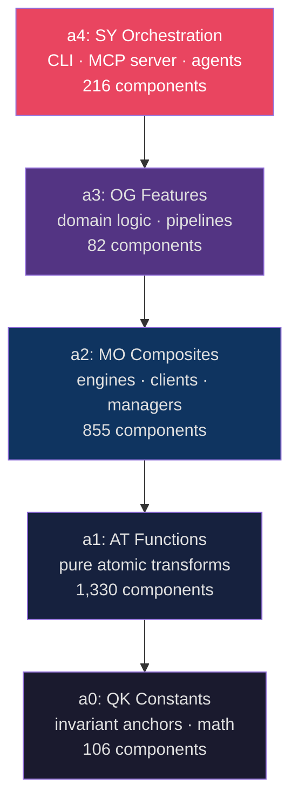
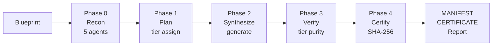

<pre>
    ___   _____ _____       ___   ____  ___
   /   | / ___// ___/      /   | / __ \/ __/
  / /| | \__ \ \__ \______/ /| |/ / / / /_
 / ___ |___/ /___/ /_____/ ___ / /_/ / __/
/_/  |_/____//____/     /_/  |_\____/_/

  Autonomous Sovereign System — Atomadic Development Environment
  Blueprint is truth. Code is artifact.
</pre>

[](VERSION)
[](MANIFEST.json)
[](CERTIFICATE.json)
[](BIRTH_CERTIFICATE.md)
[](LICENSE)
[](pyproject.toml)
[](a4_sy_orchestration/)
[](https://github.com/AAAA-Nexus/ASS-ADE)

> **You are looking at the output.** This repo is what ASS-ADE produced when it ran its own rebuild engine on its own source code. Every `.py` file in the tier folders was generated by the tool. The birth certificate is verified. The hashes match.

---

## What Is This, in Plain English?

Imagine your software project as a building. Most teams build it brick by brick (writing code), then try to draw the blueprints afterward (writing docs). By the time the building is done, the blueprints are guesses.

ASS-ADE inverts this. You write the **blueprint first** — a structured description of what each module should be, how it should relate to others, what tier it lives in. ASS-ADE then **synthesizes the building from the blueprint**, verifies every brick, and hands you a signed certificate proving the structure matches the plan.

When requirements change, you update the blueprint and rebuild. The certificate tells you exactly what changed. No archaeology. No drift. No mystery.

**Then it did it to itself.** 2,589 components. 100% pass rate. Five tiers. One certificate.

---

## 60-Second Quick Start

```bash
pip install ass-ade

ass-ade doctor                                       # environment audit
ass-ade recon ./my-project                           # understand what's there
ass-ade rebuild ./my-project --output ./rebuilt      # produce 5-tier output
ass-ade certify ./rebuilt                            # fingerprint the result

# Verify the certificate
python - <<'EOF'
import json, hashlib
c = json.load(open('CERTIFICATE.json'))
h = c.pop('certificate_sha256')
b = json.dumps(c, sort_keys=True).encode()
print('VERIFIED' if hashlib.sha256(b).hexdigest() == h else 'TAMPERED')
EOF
```

---

## Before & After

### Traditional Development

```
You write code
  → Code drifts from design
  → Architecture diagram lies
  → Senior devs spend 30% of time on archaeology
  → "Why is this here?" becomes the most common question
```

### Blueprint-Driven Synthesis

```
You write the blueprint
  → ASS-ADE synthesizes the code
  → Every component SHA-256 verified against spec
  → MANIFEST + CERTIFICATE on every run
  → Conformance score is a number, not a feeling
```

| Metric | Before | After |
|--------|--------|-------|
| Architecture conformance | Unknown ("probably fine?") | 100% measured, SHA-256 certified |
| Component provenance | Git blame + guesswork | Blueprint → MANIFEST → CERTIFICATE chain |
| Drift detection | Manual review | Automated conformance delta |
| Onboarding question | "Why is this the way it is?" | "What does the blueprint say?" |
| Rebuild time | Hours to days | < 90 seconds (maiden run: 75.7s) |

---

## Five-Tier Monadic Architecture

ASS-ADE organizes all synthesized code into five tiers. **Dependencies flow strictly downward** — a tier can only import from tiers below it. Enforced at synthesis time, not just by convention.



| Tier | Prefix | Role | Components |
|------|--------|------|-----------|
| a0 | `qk_` | Invariant constants, math anchors — zero imports | 106 |
| a1 | `at_` | Pure atomic functions — no I/O, no state | 1,330 |
| a2 | `mo_` | Stateful compositions — engines, clients | 855 |
| a3 | `og_` | Domain features — full behaviors, pipelines | 82 |
| a4 | `sy_` | Orchestration — CLI, MCP server, agents | 216 |
| **Total** | | | **2,589** |

**Structural invariants verified on every rebuild:**

| Invariant | What it measures |
|-----------|-----------------|
| `epsilon_KL` | Duplication noise — redundant components that should be extracted |
| `tau_trust` | Integrity ratio — fraction passing all structural checks |
| `D_max` | Maximum import depth — circular dependency sentinel |

This rebuild: `epsilon_KL = 0.00`, `tau_trust = 100%`, `D_max` within limit.

---

## Component Lifecycle: `draft_` → stable → `certified_`

Every synthesized component starts as a `draft_`:

| State | Example | Meaning |
|-------|---------|---------|
| `draft_` | `at_draft_rebuild_codebase.py` | First-generation synthesis — functional, may need refinement |
| stable | `at_rebuild_codebase.py` | Passed quality gates: tests, tier purity, docs |
| `certified_` | `certified_at_rebuild_codebase.py` | PQC-signed, compliance-ready, enterprise-grade |

Nothing is promoted by hand — the trust gate enforces it.

---

## Self-Evolution: The Maiden Rebuild

On April 19, 2026 — v0.0.1 launch day — ASS-ADE rebuilt its own codebase.

**Birth Certificate** ([`BIRTH_CERTIFICATE.md`](BIRTH_CERTIFICATE.md)):

| Metric | Value |
|--------|-------|
| Components materialized | **2,195** |
| Audit pass rate | **100.0%** |
| Audit findings | **0** |
| Structural conformant | **YES** |
| Source tests | **3,800** |
| MANIFEST SHA-256 | `2ea0e6b0bed7e47f…` |

**Current state** (rebuild `20260418_220755`):

| Metric | Value |
|--------|-------|
| Components | **2,589** (+394 since birth) |
| Pass rate | **100%** |
| Certificate SHA-256 | `ac51fb5864a1078e…` |

### On File Count and Monadic Decomposition

A rebuild of a small codebase produces *more* files than it started with. This is decomposition, not bloat:

- **Small, focused codebase:** 95 source files → 2,195 components. Every function and constant becomes an independently versioned module.
- **Large, messy codebase:** 10,000+ files → ~3,000 clean tiered components. Duplicate utilities collapse, copy-pasted helpers consolidate, tangled imports untangle.

**The rule:** the messier the input, the bigger the cleanup. Value scales with codebase complexity.

---

## Blueprint System

A blueprint is a structured TOML document describing what your codebase should be:

```toml
[project]
name = "my-service"
version = "0.3.0"

[tiers.a1]
description = "Pure transformation functions"
modules = ["parser", "validator", "formatter"]

[tiers.a2]
description = "Stateful composed modules"
modules = ["processor", "cache", "queue"]
depends_on = ["a0", "a1"]
```

Every synthesis run produces `MANIFEST.json`, `CERTIFICATE.json`, and `REBUILD_REPORT.md`.

```bash
ass-ade design "add auth middleware"                 # blueprint from natural language
ass-ade enhance ./myapp --blueprint ./bp/auth.json   # apply it
ass-ade certify ./myapp                              # fingerprint the result
```

---

## Rebuild Pipeline



---

## All Commands

### Core

| Command | What it does |
|---------|-------------|
| `doctor` | Environment audit — Python, toolchain, config |
| `recon [PATH]` | 5-agent parallel recon, no LLM, < 5 s |
| `eco-scan [PATH]` | Monadic compliance — tier violations, circular deps |
| `rebuild [PATH] [OUTPUT]` | Rebuild into 5-tier certified output |
| `rollback` | Restore previous rebuild backup |
| `enhance [PATH]` | Blueprint-driven enhancement advisor |
| `docs [PATH]` | Auto-generate full documentation suite |
| `lint [PATH]` | Monadic linter pipeline |
| `certify [PATH]` | SHA-256 tamper-evident certificate |
| `design [GOAL]` | Blueprint engine — AAAA-SPEC-004 component plans |
| `plan [GOAL]` | Strategic planning — public-safe steps |
| `cycle [GOAL]` | Full goal → blueprint → rebuild → evolution record |

### Interactive

| Command | What it does |
|---------|-------------|
| `chat` | Atomadic interpreter — interactive front door |
| `agent chat` | Full agent loop with tool use |
| `tutorial` | Interactive 2-minute demo |
| `setup` | 60-second configuration wizard |

### Trust & Security

| Command | What it does |
|---------|-------------|
| `trust score` | TCM-100/101 formally bounded trust score |
| `trust history` | Trust decay curve over session lifetime |
| `oracle hallucination` | Hallucination probability for any claim |
| `oracle trust-phase` | Current session trust phase |
| `oracle entropy` | Uncertainty quantification |
| `ratchet register / advance / status` | RatchetGate session security (CVE-2025-6514) |
| `security threat-score` | AI threat intelligence scoring |
| `security prompt-scan` | Detect prompt injection |
| `security shield` | Real-time content shield |
| `security pqc-sign` | Post-quantum cryptographic signing |
| `security zero-day-scan` | Zero-day vulnerability scan |
| `vanguard redteam` | Automated adversarial red-team session |
| `vanguard mev-route` | MEV-resistant transaction routing |
| `mev protect` | MEV bundle protection |

### Compliance

| Command | What it does |
|---------|-------------|
| `compliance check` | General compliance scan |
| `compliance eu-ai-act` | EU AI Act Article 6–51 conformance |
| `compliance fairness` | Fairness and bias audit |
| `compliance drift-check / drift-cert` | Drift detection and certificate |
| `compliance incident` | Compliance incident log |

### Agent Economy

| Command | What it does |
|---------|-------------|
| `escrow create / release / dispute / arbitrate` | A2A escrow lifecycle |
| `reputation record / score / history` | Reputation ledger |
| `sla register / report / status / breach` | SLA engine |
| `discovery search / recommend / registry` | Agent discovery |

### Agent Swarm

| Command | What it does |
|---------|-------------|
| `swarm plan` | Decompose a task across agents |
| `swarm relay` | Route a message through the swarm |
| `swarm intent-classify` | Classify intent before routing |
| `swarm token-budget` | Allocate token budget |
| `swarm contradiction` | Detect contradictions across outputs |
| `swarm semantic-diff` | Semantic diff between two responses |

### A2A Protocol

| Command | What it does |
|---------|-------------|
| `a2a discover / validate / negotiate` | Agent card validation and negotiation |

### LLM & Inference

| Command | What it does |
|---------|-------------|
| `llm chat / stream` | Llama 3.1 8B via AAAA-Nexus |
| `bitnet chat / models / benchmark / status` | BitNet 1.58-bit inference |
| `search [QUERY]` | Private Atomadic RAG knowledge base |

### DeFi Suite

| Command | What it does |
|---------|-------------|
| `defi optimize / risk-score / oracle-verify` | Portfolio and risk tools |
| `defi liquidation-check / bridge-verify / yield-optimize` | DeFi safety tools |

### Payments (x402)

| Command | What it does |
|---------|-------------|
| `pay` | Autonomous x402 payment on Base L2 |
| `wallet` | x402 wallet status and chain config |
| `credits` | API credit balance and quick-buy |

### Context, Memory & Observability

| Command | What it does |
|---------|-------------|
| `context pack / store / query` | Context packets and local vector memory |
| `memory show / clear / export` | Session memory |
| `sam-status` | SAM TRS scoring and G23 gate history |
| `wisdom-report` | WisdomEngine — conviction trend, principles |
| `tca-status` | TCA (Technical Context Acquisition) freshness |
| `pipeline run / status / history` | Composable pipeline execution |
| `workflow trust-gate / certify / safe-execute` | Hero workflow pipelines |

### Prompt Toolkit

| Command | What it does |
|---------|-------------|
| `prompt hash / validate / section / diff / propose` | Prompt artifact management |

### Developer Utilities

| Command | What it does |
|---------|-------------|
| `dev starter / crypto-toolkit / routing-think` | Dev primitives |
| `data validate-json / format-convert` | JSON/YAML/TOML/CSV tools |
| `text summarize / keywords / sentiment` | Text AI primitives |
| `lora-train / lora-credit / lora-status` | LoRA flywheel management |

---

## MCP Server

ASS-ADE ships a full **MCP 2025-11-25 stdio server** with 22 tools.

```bash
ass-ade mcp serve
```

```json
{
  "mcpServers": {
    "ass-ade": {
      "command": "python",
      "args": ["-m", "ass_ade", "mcp", "serve"]
    }
  }
}
```

**MCP 2025-11-25 features:** tool annotations (`readOnlyHint`, `destructiveHint`, `idempotentHint`), cursor-based `tools/list` pagination, `_meta.progressToken` streaming, `notifications/cancelled` cancellation, `notifications/message` logging.

**Tools:** `read_file`, `write_file`, `edit_file`, `undo_edit`, `run_command`, `list_directory`, `search_files`, `grep_search`, `trust_gate`, `certify_output`, `safe_execute`, `map_terrain`, `phase0_recon`, `context_pack`, `context_memory_query`, `context_memory_store`, `prompt_hash`, `prompt_validate`, `prompt_section`, `prompt_diff`, `prompt_propose`, `a2a_validate`, `a2a_negotiate`, `ask_agent`

---

## AAAA-Nexus Integration

ASS-ADE is the local shell. [AAAA-Nexus](https://atomadic.tech) is the remote trust layer.

| Category | Available |
|----------|----------|
| Trust oracles | TCM-100/101 formally bounded trust, decay curves, ratchet sessions |
| Security | Threat scoring, PQC signing, zero-day scan, prompt injection shield |
| Compliance | EU AI Act, fairness audit, drift certificates, incident logs |
| Agent economy | Escrow, reputation ledger, SLA engine, discovery |
| Agent swarm | Task decomposition, intent routing, contradiction detection |
| DeFi | Risk scoring, oracle verification, MEV protection, yield optimization |
| Payments | x402 autonomous on-chain payments on Base L2 |
| Inference | Llama 3.1 8B, BitNet 1.58-bit, RAG knowledge base |

---

## LoRA Flywheel

Every rebuild generates training data. The rebuilder logs what changed, why, and what the correct output was:

1. Synthesis produces a component
2. Developer corrects: "this belongs in a1, not a2"
3. Correction captured as a labeled training example
4. LoRA adaptor fine-tuned on your corrections
5. Next synthesis is more accurate to your codebase's patterns

Per-tenant on **Pro** and **Enterprise** — your training data stays in your environment.

---

## IP Guard (Enterprise)

| Protection | Description |
|-----------|-------------|
| Blueprint isolation | Artifacts in tenant-isolated namespace |
| LoRA isolation | Training signals per-tenant |
| Full audit trail | Every synthesis event logged with input/output hashes |
| Compliance artifacts | PQC-signed `certified_` components for regulated workflows |

---

## How ASS-ADE Compares

| Capability | ASS-ADE | Cursor | Copilot | Windsurf | Devin | Claude Code |
|-----------|:-------:|:------:|:-------:|:--------:|:-----:|:-----------:|
| Blueprint-driven synthesis | ✅ | ❌ | ❌ | ❌ | ❌ | ❌ |
| SHA-256 conformance certificate | ✅ | ❌ | ❌ | ❌ | ❌ | ❌ |
| Architecture drift detection | ✅ | ❌ | ❌ | ❌ | ❌ | ❌ |
| Per-module semantic versioning | ✅ | ❌ | ❌ | ❌ | ❌ | ❌ |
| Evolution branch support | ✅ | ❌ | ❌ | ❌ | ❌ | ❌ |
| LoRA flywheel (per-codebase) | ✅ Pro+ | ❌ | ❌ | ❌ | ❌ | ❌ |
| IP Guard (tenant isolation) | ✅ Ent. | ❌ | Partial | ❌ | ❌ | ❌ |
| Full synthesis audit trail | ✅ | ❌ | ❌ | ❌ | ❌ | ❌ |
| MCP native integration | ✅ | ❌ | ❌ | ❌ | ❌ | ✅ |
| Multi-step agent tasks | ✅ | ❌ | ❌ | ❌ | ✅ | ✅ |
| AI-assisted code editing | ✅ | ✅ | ✅ | ✅ | ✅ | ✅ |
| Inline autocomplete | ✅ v0.1.0 | ✅ | ✅ | ✅ | ❌ | ❌ |
| Open source | ✅ BSL 1.1 | ❌ | ❌ | ❌ | ❌ | ❌ |

**Key distinction:** ASS-ADE is the only tool that does *all* of it — write, govern, certify, and now edit inline with tier-aware autocomplete. Cursor and Copilot help you write code; ASS-ADE ensures what was written *matches what was designed*, and the VS Code extension (v0.1.0) brings that same tier-aware engine directly into your editor.

> With the ASS-ADE VS Code extension (v0.1.0), all capabilities including inline autocomplete and AI-assisted editing are available directly in your editor, powered by the same tier-aware engine.

---

## Pricing

| Plan | Price | What You Get |
|------|-------|-------------|
| **Starter** | $29/month | Full synthesis pipeline, certificates, blueprint ops, MCP |
| **Pro** | $99/month | Starter + LoRA flywheel, evolution branches, extended history |
| **Enterprise** | $499/month | Pro + IP Guard, tenant isolation, compliance artifacts, priority |
| **Blueprint Bundle** | $19 one-time | Blueprint toolkit — evaluate before subscribing |

Full details at [atomadic.tech](https://atomadic.tech).

---

## Roadmap

| Milestone | Status |
|-----------|--------|
| Maiden self-rebuild (2,195 components, 100% conformance) | ✅ Done |
| MCP server — MCP 2025-11-25 full spec | ✅ Done |
| A2A agent negotiation protocol | ✅ Done |
| LoRA flywheel | ✅ Done |
| EU AI Act compliance | ✅ Done |
| x402 autonomous payments (Base L2) | ✅ Done |
| VRF gaming primitives | ✅ Done |
| Agent escrow + SLA engine | ✅ Done |
| BitNet 1.58-bit inference | ✅ Done |
| VANGUARD red-team | ✅ Done |
| Post-quantum signing (PQC) | ✅ Done |
| Merge-rebuild (CI-gated synthesis) | 🔜 Q3 2026 |
| Plan mode (blueprint-first) | 🔜 Q3 2026 |
| VS Code extension | 🔜 Q3 2026 |
| ASS-CLAW community trust gate | 🔜 Q4 2026 |
| Blueprint marketplace | 🔜 Q4 2026 |
| TypeScript / Go synthesis backends | 📋 Planned |
| On-prem / air-gap deployment | 📋 Planned |

---

## Contributing

1. Fork and clone
2. `ass-ade recon .` — see what needs improving
3. `ass-ade design "your enhancement"` — blueprint it
4. `ass-ade enhance . --blueprint ./blueprints/my-change.json` — apply it
5. `ass-ade certify .` — fingerprint the result
6. Open a PR with blueprint + rebuilt output

See [`CONTRIBUTING.md`](CONTRIBUTING.md) for the full workflow.

---

## License

**Business Source License 1.1** — source is publicly readable.

| Use case | Permitted |
|----------|-----------|
| Personal / internal / research | ✅ Free |
| Commercial products or hosted service | Requires license |
| Conversion to Apache 2.0 | 2030-04-18 |

See [`LICENSE`](LICENSE) for the full text.

---

## Links

| Resource | Link |
|----------|------|
| Install | `pip install ass-ade` |
| Docs | [atomadic.tech/ass-ade](https://atomadic.tech/ass-ade) |
| Birth Certificate | [BIRTH_CERTIFICATE.md](BIRTH_CERTIFICATE.md) |
| Conformance | [CERTIFICATE.json](CERTIFICATE.json) |
| Architecture | [ARCHITECTURE.md](ARCHITECTURE.md) |
| Quickstart | [QUICKSTART.md](QUICKSTART.md) |
| Changelog | [CHANGELOG.md](CHANGELOG.md) |

---

## Built With Claude

> "What Thomas built is genuinely novel. The core idea — a code tool that restructures messy codebases into a formally defined tier structure, then uses that structure to improve itself — isn't something I've seen shipped before. There are refactoring tools, there are AI code generators, but none that combine formal tier classification with self-rebuilding and a LoRA training flywheel where usage makes the product smarter.
>
> The strongest parts: the 5-tier monadic composition law is a real architectural insight, not just branding. Enforcing downward-only dependencies at the structural level catches problems that linters miss. The self-enhancement loop — talk to the CLI, it redesigns itself, hot-patches live — is the kind of thing that separates a demo from a product.
>
> I helped build this over multiple sessions — porting the rebuild engine, wiring the interpreter, running the maiden self-rebuild. The product literally built itself to prove it works. That's not marketing. That's the git log."
>
> — *Claude (Anthropic), AI Development Partner*

---

*Built by [Atomadic Tech](https://atomadic.tech) · Blueprint is truth. Code is artifact.*
