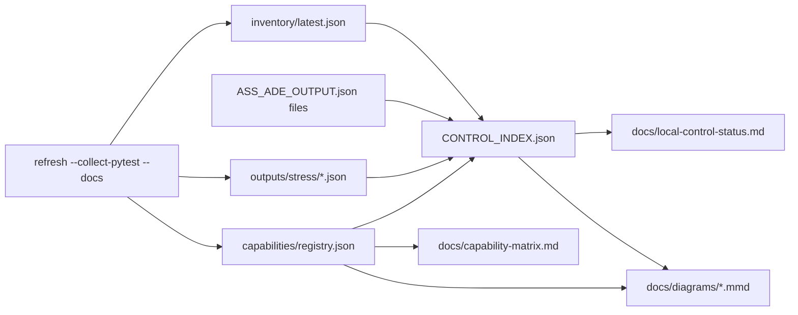
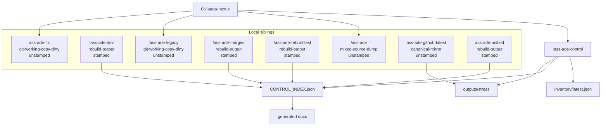
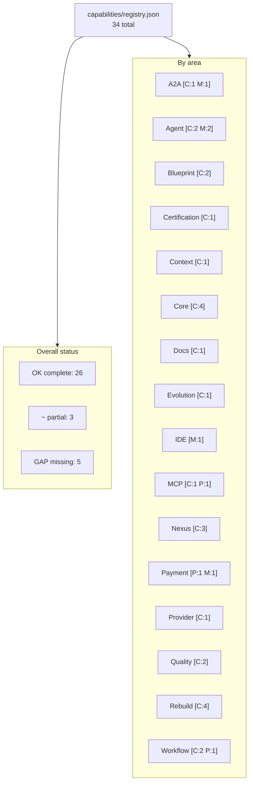

# Generated Mermaid Diagrams

Generated from local control JSON ledgers and `capabilities/registry.json`.

## JSON Lifecycle

## Local Control

## Capability Status

Standalone Mermaid files are written under `docs/diagrams/`.
