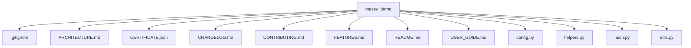

# Architecture

## Repository Overview

- **Total files:** 12
- **Total directories:** 0
- **Primary language:** md
- **Detected languages:** md, py, json

## Top-Level Structure

## Entry Points

_none detected_

## Test Framework

_none detected_

## CI Systems

_none detected_
