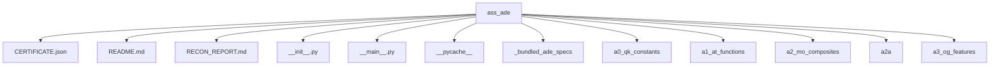

# Architecture

## Repository Overview

- **Total files:** 200
- **Total directories:** 22
- **Primary language:** py
- **Detected languages:** py, json, md

## Top-Level Structure

## Entry Points

_none detected_

## Test Framework

_none detected_

## CI Systems

_none detected_
